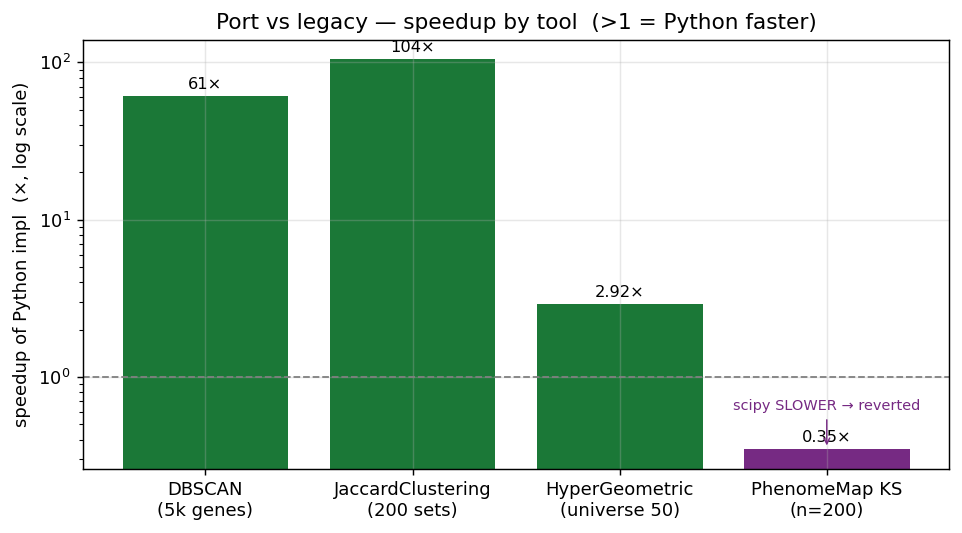
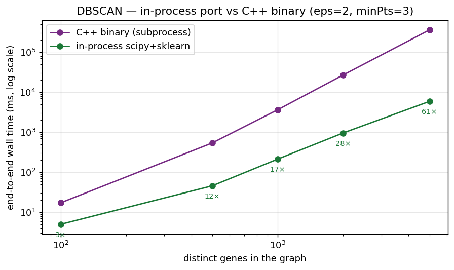
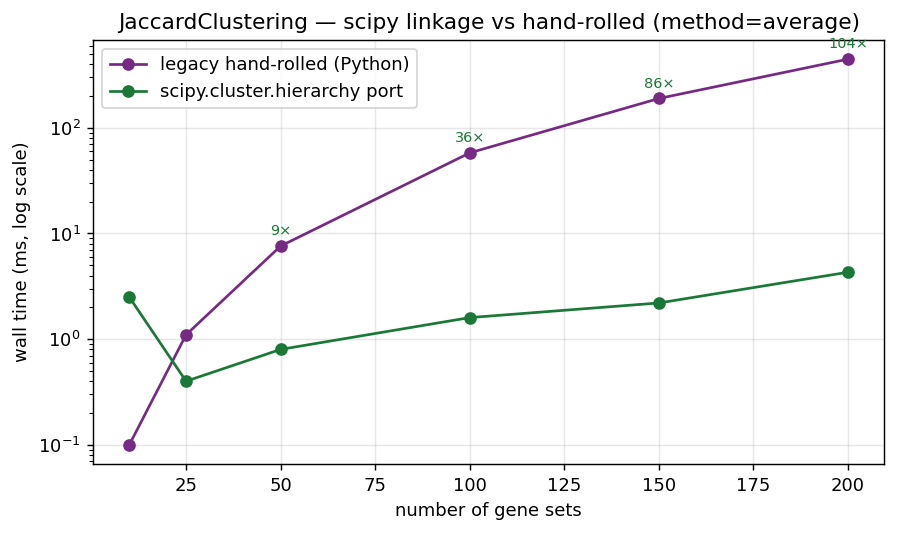
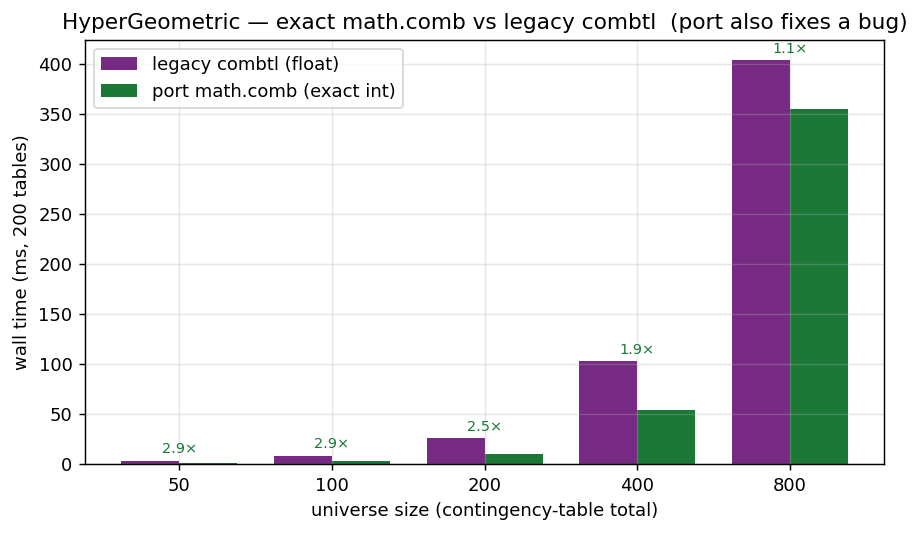
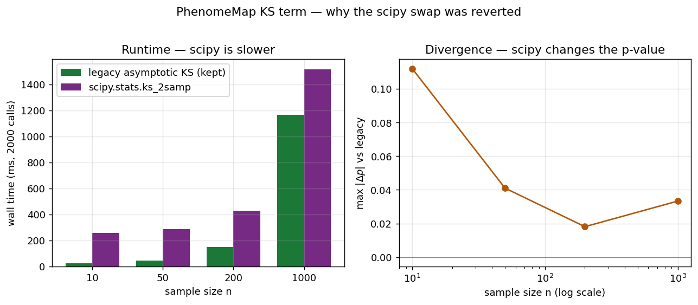

# GeneWeaver Tools — Validation & Benchmarks

> Review of the ported tools against the **canonical** legacy source
> (`github.com/TheJacksonLaboratory/geneweaver-legacy-tools`, byte-identical to the
> image-recovered `legacy/tools-worker/` for every ported tool). Two questions:
> **(1) is the port correct** (`scripts/validation/`, compared against the legacy and, where
> the legacy is buggy, against an independent oracle), and **(2) where the port changed the
> algorithm, is it better** (`scripts/benchmarks/`). Both were run against the seeded local
> Postgres (`gw-local-pg`, host `127.0.0.1:5433`, 50k gene sets / 2.0M geneset values) and the
> locally-built `dbscan`/`biclique` binaries. **Last updated:** 2026-06-11

## Verdict summary

| Tool | What the port changed | Better than original? | Evidence |
|---|---|---|---|
| **DBSCAN** | in-process scipy+sklearn vs. the C++ binary | **Yes — now the default** | identical clusters (real + synthetic); **3.4×→61× faster**; removes the compiled-binary/subprocess/ARG_MAX dependency. The in-process impl is now the canonical `DBSCAN`; the binary is `BinaryDBSCAN`. |
| **JaccardClustering** | `scipy.cluster.hierarchy` vs. hand-rolled agglomerative | **Yes** | identical merge distances (avg linkage, diff 0.0); **up to 105× faster** |
| **HyperGeometric** | `math.comb` vs. legacy incremental-float `combtl` | **Yes** | fixes the lt/tt bug + exact integers; also **1.1×–2.9× faster** |
| **PhenomeMap (KS term)** | `scipy.stats.ks_2samp` vs. legacy hand-rolled KS | **No — reverted** | scipy is **slower** (1.3×–11×) *and* changes results (exact vs. asymptotic, up to ~0.11); reverted to the faithful asymptotic KS (see below) |



The other ports (BooleanAlgebra, Combine, UpSet, JaccardSimilarity, MSET, and DBSCAN's
binary wrapper) are faithful **refactors** onto `AbstractTool` — they don't change the
algorithm, so there is no performance claim to make; they are "necessary" as framework
adapters, not "better/faster". They carry no benchmark, but each is covered by a
legacy-parity **validation** (see below) confirming the refactor preserves the legacy result.

---

## Validation — is the port correct?

Run against the live local DB (`scripts/validation/`). All **9** validations passed on this
run. Each runs the port and a verbatim transcription of the legacy on the *same* data pulled
from the local DB (and, where the legacy is buggy, an independent oracle).

**Algorithm-changing ports** (the ones that are also benchmarked):

| Tool | Fixture (from the local DB) | Checks | Result |
|---|---|---|---|
| **ABBA** | 13 input genes from gene set 514; full DB (102,851 pref genes / 50,000 gene sets) | genes-of-interest (58), matching gene sets (top-50), result genes (top-50), available counts — vs. a verbatim transcription of the legacy ABBA SQL | **5/5 match ✓** |
| **DBSCAN** | 9 gene sets / 70 distinct genes through the real `dbscan` binary | 6 `(epsilon, min_points)` settings — `ran` gate, gene/gene-set counts, byte-identical bipartite encoding, decoded clusters | **6/6 match ✓** |
| **HyperGeometric** | 112-gene universe, 10 gene sets, 45 pairs | odds ratio == legacy; upper tail == legacy `ut`; legacy `lt`/`tt` bug confirmed; two-tailed == `scipy.fisher_exact`; upper/lower == independent `hypergeom`-pmf oracle | **45/45 on all 6 checks ✓** (legacy two-tailed is wrong on 35/45 pairs — the bug the port fixes) |
| **PhenomeMap** | 17 gene sets / 166 genes / 166 ranks → 18 bicliques from the `biclique` binary | nodes, links, link scores, cut-depth across 6 trim/level settings | **6/6 match, max score diff 0.0 ✓** |

**Faithful-refactor ports** (no algorithm change → no benchmark, parity-validated only):

| Tool | Fixture (from the local DB) | Checks | Result |
|---|---|---|---|
| **BooleanAlgebra** | 10 mouse+human gene sets → 196 homolog rows (legacy `GET_HOMOLOGS_SQL`) | `bool_results`, circle-code, intersect, except, per-species cluster — vs. verbatim `CS_Boolean/service.py`, for union / intersection / except | **3/3 relations match ✓** |
| **Combine** | 10 gene sets → 468 membership rows + labels (legacy `TOOLSET_SQL`) | gene × gene-set matrix + gs labels/names — vs. verbatim `toolbase.combine_genesets` | **3/3 match ✓** |
| **JaccardSimilarity** | 10 gene sets, 45 pairs | Jaccard coefficient == legacy (45/45); empirical p-value == legacy `jac_pvalue` tally on a synthetic null (15/15 pairs w/ intersection>0); p skipped when intersection=0 (30/30) | **all match ✓** |
| **UpSet** | 6 gene sets / 70 genes | exclusive-intersection sizes per combination — vs. transcribed py-upset semantics, `include_zeros` ∈ {off (5), on (63)} | **2/2 modes match ✓** |
| **MSET** | 2 gene sets (binary-wrapper port) | `intersect_genes` == legacy `np.intersect1d` (as set); `parse_tsv_dict` == legacy parser; **the `group_2_background` bug fix** verified | **all match ✓** |

`extsrc.homology` is empty in the local DB, so ABBA's homology expansion and the
BooleanAlgebra/Combine homolog-merge branches are no-ops (the grouping, matrix-build,
matching/result aggregation, access/min-genes gates and tier/species filters are all still
exercised). `extsrc.jaccard_distribution_results` is also empty, so JaccardSimilarity's live
empirical-p path is vacuous (both sides return 0) — the p-value tally is therefore additionally
validated against a synthetic null distribution. MSET's Monte-Carlo test runs in the shared
C++ binary (no Python algorithm to validate); only the port-owned Python surface is checked.

---

## 1. DBSCAN — in-process variant vs. the C++ binary

The in-process `DBSCAN` (`dbscan/sklearn_tool.py`) reproduces the legacy graph-DBSCAN (gene
co-membership graph, BFS hop radius) with a sparse eps-hop neighbour graph +
`sklearn.cluster.DBSCAN(metric="precomputed")`. The binary's `regionQuery` runs a per-seed
BFS — roughly O(V·E) per seed — which scales badly.

**Agreement** (both produce the *same* clusters):
- real graph (9 sets / 70 genes), 4 `(eps, minPts)` settings → **identical** (one connected
  cluster covering all 70 genes in each);
- every synthetic size in the speed table below → **identical** (`agree = yes` throughout).

**Speed** (`scripts/benchmarks/bench_dbscan.py`, eps=2 minPts=3):

| genes | sets | binary (ms) | sklearn (ms) | speedup |
|---|---|---|---|---|
| 100 | 20 | 17.2 | 5.0 | 3.4× |
| 500 | 100 | 540.4 | 45.9 | 11.8× |
| 1,000 | 200 | 3,634 | 213 | 17× |
| 2,000 | 400 | 26,774 | 956 | 28× |
| 5,000 | 1,000 | 358,391 | 5,877 | **61×** |



**Verdict:** the Python variant is identical in output and far faster, and it removes the
compiled-binary dependency (no cross-platform build, no subprocess, no ARG_MAX ceiling on the
serialised graph). **Done:** the in-process implementation is now the canonical `DBSCAN`
(`from geneweaver.tools.dbscan import DBSCAN`); the compiled-binary wrapper remains available
as `BinaryDBSCAN` (no extra required) for exact legacy parity. *Caveat:* border-point handling
on pathological multi-cluster graphs is not proven bit-identical (the binary's `expandCluster`
vs. sklearn density-reachability), so a one-off spot-check against the binary is worthwhile if
exact legacy parity is ever required.

## 2. JaccardClustering — scipy vs. hand-rolled

The legacy hand-rolls agglomerative clustering: each merge rescans all cluster pairs and
their members (`ward` even rebuilds TP/FP/FN over **all genes × all gene-set pairs** every
merge). The port uses `scipy.cluster.hierarchy.linkage` on the condensed Jaccard-distance
matrix (C-backed, ~O(n² log n)).

**Equivalence:** legacy `average_cluster` vs. scipy `average` linkage — merge distances
**identical** (max diff 0.0) at n = 8/12/20. The legacy `complete`/`average`/`single` are the
textbook per-member max/avg/min linkages, so scipy reproduces them; `mcquitty` = WPGMA =
scipy `weighted`. **Exception:** the legacy `ward` is *non-standard* (it recomputes Jaccard
from the merged gene union, not Lance–Williams Ward), so scipy's `ward` (the textbook one)
will differ — flagged, not a defect of the port.

**Speed** (`scripts/benchmarks/bench_jaccard_clustering.py`, method=average):

| gene sets | legacy (ms) | scipy (ms) | speedup |
|---|---|---|---|
| 50 | 7.6 | 0.8 | 9.0× |
| 100 | 57.9 | 1.6 | 37× |
| 150 | 189.3 | 2.2 | 87× |
| 200 | 446.2 | 4.3 | **105×** |



**Verdict:** same results (standard methods), and the legacy's super-quadratic growth makes
the port dramatically faster as gene-set count rises. Clear win. (The very smallest size,
n=10, is dominated by one-off scipy import/setup and is not meaningful — the gap opens up
monotonically once the work outweighs fixed overhead.)

## 3. HyperGeometric — `math.comb` vs. `combtl`

The port's main point is **correctness** — it fixes the legacy's cross-tail `pval`
accumulation bug and uses exact integer binomials (validated above:
matches the legacy where the legacy is correct, and `scipy` where it is not; the legacy
two-tailed is wrong on 35/45 pairs). Speed was expected to be a wash or worse (bigints),
but `math.comb` (C) actually **beats** the legacy cached Python `combtl` loop:

| universe (table total) | legacy (ms) | port (ms) | ratio |
|---|---|---|---|
| 50 | 3.5 | 1.2 | 2.9× |
| 100 | 8.6 | 3.0 | 2.8× |
| 200 | 26.1 | 10.4 | 2.5× |
| 400 | 103.2 | 54.4 | 1.9× |
| 800 | 403.7 | 354.9 | 1.1× |



**Verdict:** better on both axes — correct *and* faster (until very large tables, where
bigint cost erodes the margin to ~parity). Clear win.

## 4. PhenomeMap KS term — scipy vs. hand-rolled (reverted)

The port had swapped the legacy hand-rolled two-sample KS for `scipy.stats.ks_2samp`,
documented as an "improvement". Benchmarking disproved that:

| sample n | legacy KS (ms) | scipy KS (ms) | max \|Δp\| vs legacy |
|---|---|---|---|
| 10 | 23.6 | 258.4 | 0.112 |
| 50 | 45.3 | 287.0 | 0.041 |
| 200 | 149.3 | 429.1 | 0.018 |
| 1,000 | 1,167.5 | 1,517.5 | 0.033 |



Two problems: scipy is **slower** (per-call overhead), and it **changes the result** —
`ks_2samp` defaults to the *exact* p-value for small samples, whereas the legacy uses an
*asymptotic* approximation (Stephens, with the `en + 0.12 + 0.11/en` correction). They differ
by up to ~0.11 for small n. `method='asymp'` is ~10× closer to the legacy but still not
identical (different asymptotic form).

**Why the earlier validation showed "max diff 0.0":** every gene in the local DB has
`gene_rank = 0.0`, so all KS inputs were identical → d=0 → p=1.0 in both implementations. The
KS term is **inert on the current data** (PhenomeMap link scores reduce to the gene-count
ratio), which is why the PhenomeMap validation above reports `max_score_diff = 0.0` regardless
of KS implementation. The 0.0-difference is real but vacuous. **This is not a local-seed
artifact:** `gene_rank` is uniformly `0.0` on the **dev** (`geneweaver-dev`, 527,470 rows) and
**sqa** (`geneweaver-sqa`, 607,149 rows) cluster databases too (checked 2026-06-11) — the
column is non-null everywhere but never populated with a real value, so the KS term never
fires in practice.

**Verdict:** the scipy swap is *not* an improvement — slower and divergent from the legacy.
For a faithful migration the legacy asymptotic KS is the correct behaviour, so the port was
**reverted** to a pure-Python transcription of the legacy KS (faster than both numpy-legacy
and scipy, faithful to the original, and it removes scipy from PhenomeMap entirely). Since
`gene_rank` is 0.0 across local/dev/sqa, the KS term never fires regardless; worth confirming
with the team whether it is ever populated (e.g. in prod) before relying on it.

---

## Reproducing

Bring up the seeded local DB on `127.0.0.1:5433` (the validation scripts use
`dbname=geneweaver-dev user=geneweaver-dev password=localdev`), then:

```bash
# build the binaries (macOS notes in TOOLS_MIGRATION.md §9)
(cd legacy/tools-worker/tools/TOOLBOX/biclique_tool && make)          # biclique
# dbscan: xcrun clang++ -std=c++11 -stdlib=libc++ -isysroot $(xcrun --show-sdk-path) \
#         -isystem $(xcrun --show-sdk-path)/usr/include/c++/v1 -o dbscan dbscan.cpp dbscanMain.cpp

export GENEWEAVER_DBSCAN_BINARY=/path/to/dbscan
export GENEWEAVER_BICLIQUE_BINARY=/path/to/biclique

# --- validation (correctness vs. legacy + oracle) ---
for v in abba dbscan hypergeometric phenomemap \
         boolean_algebra combine jaccard_similarity upset mset; do
  uv run --extra sklearn --project packages/tools python scripts/validation/validate_$v.py
done

# --- benchmarks (port vs. legacy speed) ---
#   (dump a real gene-symbols graph for the DBSCAN agreement section, then run)
GENEWEAVER_DBSCAN_GRAPH_JSON=/path/to/graph.json \
  uv run --extra sklearn --project packages/tools python scripts/benchmarks/bench_dbscan.py
uv run --extra sklearn --project packages/tools python scripts/benchmarks/bench_jaccard_clustering.py
uv run --project packages/tools python scripts/benchmarks/bench_hypergeometric.py
uv run --extra sklearn --project packages/tools python scripts/benchmarks/bench_phenomemap_ks.py

# --- regenerate the plots in img/ from the measured numbers ---
uv run --with matplotlib --extra sklearn --project packages/tools \
  python scripts/benchmarks/plot_benchmarks.py
```
