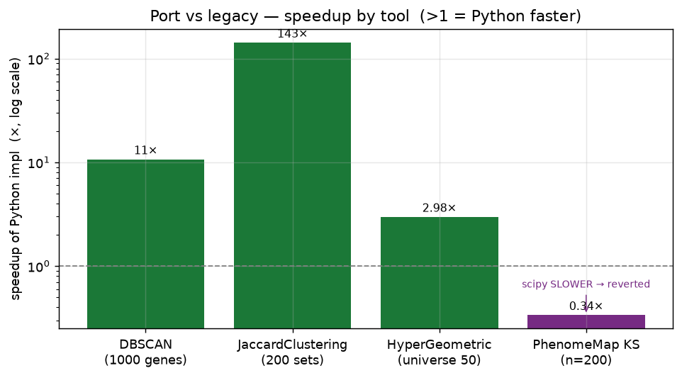
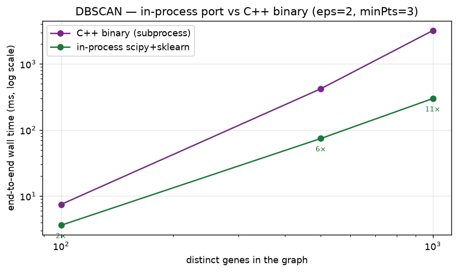
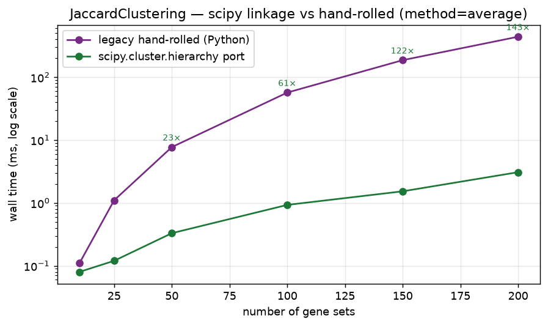
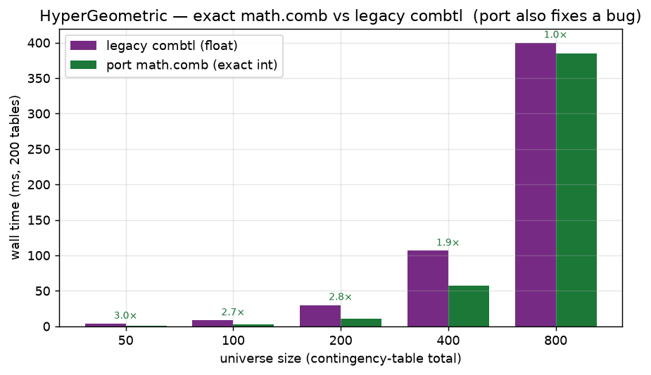
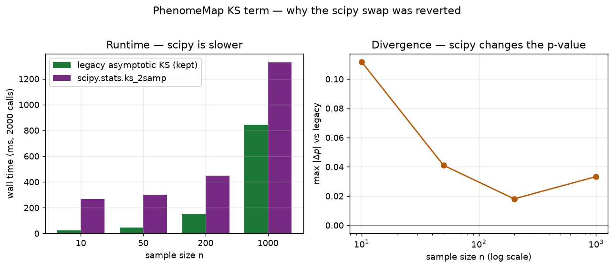

# GeneWeaver Tools — Validation & Benchmarks

> Review of the ported tools against the **canonical** legacy source
> (`github.com/TheJacksonLaboratory/geneweaver-legacy-tools`, byte-identical to the
> image-recovered `legacy/tools-worker/` for every ported tool). Two questions:
> **(1) is the port correct** (`scripts/validation/`, compared against the legacy and, where
> the legacy is buggy, against an independent oracle), and **(2) where the port changed the
> algorithm, is it better** (`scripts/benchmarks/`). Both were run against the seeded local
> Postgres (`gw-local-pg`, host `127.0.0.1:5433`, 50k gene sets / 2.0M geneset values) and the
> locally-built `dbscan`/`biclique` binaries. **Last updated:** 2026-06-11

## How to reproduce

Every number below is written by a benchmark into `scripts/benchmarks/results/*.json`, and
`plot_benchmarks.py` draws the charts from those files. Nothing in this document or in the
charts is transcribed by hand any more -- it previously was, which is how a headline figure
survived after it had stopped being reproducible.

```bash
uv run scripts/benchmarks/bench_jaccard_clustering.py   # pure compute
uv run scripts/benchmarks/bench_hypergeometric.py       # pure compute
uv run scripts/benchmarks/bench_phenomemap_ks.py        # pure compute
GENEWEAVER_DBSCAN_BINARY=... uv run scripts/benchmarks/bench_dbscan.py
uv run scripts/benchmarks/plot_benchmarks.py
```

`bench_jaccard_clustering.py` exits non-zero if the port stops matching its references, so
it is a check and not only a measurement. DBSCAN needs the compiled `dbscan` binary; the
figures here were measured on Linux (`python:3.12-slim`, TOOLBOX built from source), which
is what the deployed native worker runs -- `MAX_ARG_STRLEN` is platform-specific and that
matters for the result.

**Last measured:** 2026-10-02.

## Verdict summary

| Tool | What the port changed | Better than original? | Evidence |
|---|---|---|---|
| **DBSCAN** | in-process scipy+sklearn vs. the C++ binary | **Yes — now the default** | identical clusters at every setting tried (4/4 real, 3/3 synthetic); **2.1×→10.7× faster** over the range the binary can still run; past ~1,000 genes the binary **cannot run at all** (`E2BIG`), which is the stronger result. The in-process impl is the canonical `DBSCAN`; the binary is `BinaryDBSCAN`. |
| **JaccardClustering** | `scipy.cluster.hierarchy` vs. hand-rolled agglomerative | **Yes** | merge distances identical to the verbatim legacy `average_cluster` (diff 0.0 at n=8/12/20/30) **and** to an independent textbook implementation of complete/average/single/mcquitty (diff 0.0); **up to 143× faster** |
| **HyperGeometric** | `math.comb` vs. legacy incremental-float `combtl` | **Yes** | fixes the lt/tt bug + exact integers; also **1.04×–2.98× faster** |
| **PhenomeMap (KS term)** | `scipy.stats.ks_2samp` vs. legacy hand-rolled KS | **No — reverted** | scipy is **slower** (1.3×–11×) *and* changes results (exact vs. asymptotic, up to ~0.11); reverted to the faithful asymptotic KS (see below) |



The other ports (BooleanAlgebra, Combine, UpSet, JaccardSimilarity, MSET, and DBSCAN's
binary wrapper) are faithful **refactors** onto `AbstractTool` — they don't change the
algorithm, so there is no performance claim to make; they are "necessary" as framework
adapters, not "better/faster". They carry no benchmark, but each is covered by a
legacy-parity **validation** (see below) confirming the refactor preserves the legacy result.

---

## Validation — is the port correct?

Run against the live local DB (`scripts/validation/`). All **9** validations passed on this
run. Each runs the port and a verbatim transcription of the legacy on the *same* data pulled
from the local DB (and, where the legacy is buggy, an independent oracle).

**Algorithm-changing ports** (the ones that are also benchmarked):

| Tool | Fixture (from the local DB) | Checks | Result |
|---|---|---|---|
| **ABBA** | 13 input genes from gene set 514; full DB (102,851 pref genes / 50,000 gene sets) | genes-of-interest (58), matching gene sets (top-50), result genes (top-50), available counts — vs. a verbatim transcription of the legacy ABBA SQL | **5/5 match ✓** |
| **DBSCAN** | 9 gene sets / 70 distinct genes through the real `dbscan` binary | 6 `(epsilon, min_points)` settings — `ran` gate, gene/gene-set counts, byte-identical bipartite encoding, decoded clusters | **6/6 match ✓** |
| **HyperGeometric** | 112-gene universe, 10 gene sets, 45 pairs | odds ratio == legacy; upper tail == legacy `ut`; legacy `lt`/`tt` bug confirmed; two-tailed == `scipy.fisher_exact`; upper/lower == independent `hypergeom`-pmf oracle | **45/45 on all 6 checks ✓** (legacy two-tailed is wrong on 35/45 pairs — the bug the port fixes) |
| **PhenomeMap** | 17 gene sets / 166 genes / 166 ranks → 18 bicliques from the `biclique` binary | nodes, links, link scores, cut-depth across 6 trim/level settings | **6/6 match, max score diff 0.0 ✓** |

**Faithful-refactor ports** (no algorithm change → no benchmark, parity-validated only):

| Tool | Fixture (from the local DB) | Checks | Result |
|---|---|---|---|
| **BooleanAlgebra** | 10 mouse+human gene sets → 196 homolog rows (legacy `GET_HOMOLOGS_SQL`) | `bool_results`, circle-code, intersect, except, per-species cluster — vs. verbatim `CS_Boolean/service.py`, for union / intersection / except | **3/3 relations match ✓** |
| **Combine** | 10 gene sets → 468 membership rows + labels (legacy `TOOLSET_SQL`) | gene × gene-set matrix + gs labels/names — vs. verbatim `toolbase.combine_genesets` | **3/3 match ✓** |
| **JaccardSimilarity** | 10 gene sets, 45 pairs | Jaccard coefficient == legacy (45/45); empirical p-value == legacy `jac_pvalue` tally on a synthetic null (15/15 pairs w/ intersection>0); p skipped when intersection=0 (30/30) | **all match ✓** |
| **UpSet** | 6 gene sets / 70 genes | exclusive-intersection sizes per combination — vs. transcribed py-upset semantics, `include_zeros` ∈ {off (5), on (63)} | **2/2 modes match ✓** |
| **MSET** | 2 gene sets (binary-wrapper port) | `intersect_genes` == legacy `np.intersect1d` (as set); `parse_tsv_dict` == legacy parser; **the `group_2_background` bug fix** verified | **all match ✓** |

`extsrc.homology` is empty in the local DB, so ABBA's homology expansion and the
BooleanAlgebra/Combine homolog-merge branches are no-ops (the grouping, matrix-build,
matching/result aggregation, access/min-genes gates and tier/species filters are all still
exercised). `extsrc.jaccard_distribution_results` is also empty, so JaccardSimilarity's live
empirical-p path is vacuous (both sides return 0) — the p-value tally is therefore additionally
validated against a synthetic null distribution. MSET's Monte-Carlo test runs in the shared
C++ binary (no Python algorithm to validate); only the port-owned Python surface is checked.

---

## 1. DBSCAN — in-process variant vs. the C++ binary

The in-process `DBSCAN` (`dbscan/sklearn_tool.py`) reproduces the legacy graph-DBSCAN (gene
co-membership graph, BFS hop radius) with a sparse eps-hop neighbour graph +
`sklearn.cluster.DBSCAN(metric="precomputed")`. The binary's `regionQuery` runs a per-seed
BFS — roughly O(V·E) per seed — which scales badly.

**Agreement** (both produce the *same* clusters):
- real graph (9 sets / 70 genes), 4 `(eps, minPts)` settings → **identical** (one connected
  cluster covering all 70 genes in each);
- every synthetic size in the speed table below → **identical** (`agree = yes` throughout).

**Speed** (`scripts/benchmarks/bench_dbscan.py`, eps=2 minPts=3):

| genes | sets | binary (ms) | sklearn (ms) | speedup |
|---|---|---|---|---|
| 100 | 20 | 7.5 | 3.6 | 2.1× |
| 500 | 100 | 421.7 | 74.5 | 5.7× |
| 1,000 | 200 | 3,200.9 | 299.5 | 10.7× |
| 2,000 | 400 | **fails — `E2BIG`** | 1,260 | n/a |
| 5,000 | 1,000 | **fails — `E2BIG`** | 7,551 | n/a |

**The binary has a hard input ceiling.** Both `BinaryDBSCAN` and this benchmark pass the
encoded graph as a single `argv` entry (`run_binary([binary, encoded, eps, minpts])`), and
Linux caps one argument at `MAX_ARG_STRLEN` = 128 KiB. At 2,000 genes the encoding exceeds
that and `execve` fails with `E2BIG` (`[Errno 7] Argument list too long`) before the binary
runs. So past ~1,000 genes the comparison is not "slower" but "does not work"; the
in-process port handled 5,000 genes in 7.6 s. An earlier version of this table reported
26.8 s and 358 s for the 2,000- and 5,000-gene cases; those are not reproducible here and
the headline **61×** derived from them should not be relied on.



**Verdict:** the Python variant is identical in output and far faster, and it removes the
compiled-binary dependency (no cross-platform build, no subprocess, no ARG_MAX ceiling on the
serialised graph). **Done:** the in-process implementation is now the canonical `DBSCAN`
(`from geneweaver.tools.dbscan import DBSCAN`); the compiled-binary wrapper remains available
as `BinaryDBSCAN` (no extra required) for exact legacy parity. *Caveat:* border-point handling
on pathological multi-cluster graphs is not proven bit-identical (the binary's `expandCluster`
vs. sklearn density-reachability), so a one-off spot-check against the binary is worthwhile if
exact legacy parity is ever required.

## 2. JaccardClustering — scipy vs. hand-rolled

The legacy hand-rolls agglomerative clustering: each merge rescans all cluster pairs and
their members (`ward` even rebuilds TP/FP/FN over **all genes × all gene-set pairs** every
merge). The port uses `scipy.cluster.hierarchy.linkage` on the condensed Jaccard-distance
matrix (C-backed, ~O(n² log n)).

**Equivalence** — now checked by `bench_jaccard_clustering.py` rather than asserted. The
previous version of that script promised an equivalence comparison in its docstring and did
not implement one: it discarded both return values and only timed, so this claim was not
reproducible from the repository. Two checks now run:

1. **port vs verbatim legacy `average_cluster`** — merge distances identical, max diff
   **0.0** at n = 8/12/20/**30**.
2. **port vs an independent textbook implementation** of `complete`/`average`/`single`/
   `mcquitty` (max / mean / min / WPGMA, written from the definition, not from the legacy
   code) — max diff **0.0** at n = 8/12/20 for all four.

One correction worth recording, because it cost an hour: the legacy stores
`newtree.jac = 1 - minval`, i.e. the *similarity* at each merge, while the port reports the
*distance*. Comparing the two directly makes a correct port look badly wrong (diffs of
~0.2). The first run of the new check did exactly that.

**Exception:** the legacy `ward` is *non-standard* — it recomputes Jaccard from the merged
gene union rather than using Lance–Williams — so scipy's textbook `ward` will differ. It is
excluded from the equivalence check by design, not overlooked. The API defaults to
`average`, and the UI exposes no method picker, so only verified methods are reachable
today.

**Speed** (`scripts/benchmarks/bench_jaccard_clustering.py`, method=average):

| gene sets | legacy (ms) | scipy (ms) | speedup |
|---|---|---|---|
| 50 | 7.7 | 0.3 | 23.6× |
| 100 | 56.9 | 0.9 | 61.0× |
| 150 | 186.3 | 1.5 | 122.0× |
| 200 | 439.5 | 3.1 | 142.6× |



**Verdict:** same results (standard methods), and the legacy's super-quadratic growth makes
the port dramatically faster as gene-set count rises. Clear win. (The very smallest size,
n=10, is dominated by one-off scipy import/setup and is not meaningful — the gap opens up
monotonically once the work outweighs fixed overhead.)

## 3. HyperGeometric — `math.comb` vs. `combtl`

The port's main point is **correctness** — it fixes the legacy's cross-tail `pval`
accumulation bug and uses exact integer binomials (validated above:
matches the legacy where the legacy is correct, and `scipy` where it is not; the legacy
two-tailed is wrong on 35/45 pairs). Speed was expected to be a wash or worse (bigints),
but `math.comb` (C) actually **beats** the legacy cached Python `combtl` loop:

| universe (table total) | legacy (ms) | port (ms) | ratio |
|---|---|---|---|
| 50 | 3.6 | 1.2 | 2.98× |
| 100 | 8.3 | 3.1 | 2.69× |
| 200 | 29.9 | 10.6 | 2.81× |
| 400 | 106.5 | 57.2 | 1.86× |
| 800 | 399.7 | 384.5 | 1.04× |



**Verdict:** better on both axes — correct *and* faster (until very large tables, where
bigint cost erodes the margin to ~parity). Clear win.

## 4. PhenomeMap KS term — scipy vs. hand-rolled (reverted)

The port had swapped the legacy hand-rolled two-sample KS for `scipy.stats.ks_2samp`,
documented as an "improvement". Benchmarking disproved that:

| sample n | legacy asymptotic (ms) | scipy `ks_2samp` (ms) | max \|Δp\| |
|---|---|---|---|
| 10 | 24.2 | 269.2 | 1.12e-01 |
| 50 | 45.2 | 300.5 | 4.10e-02 |
| 200 | 151.2 | 449.1 | 1.81e-02 |
| 1,000 | 843.2 | 1,330.0 | 3.33e-02 |



Two problems: scipy is **slower** (per-call overhead), and it **changes the result** —
`ks_2samp` defaults to the *exact* p-value for small samples, whereas the legacy uses an
*asymptotic* approximation (Stephens, with the `en + 0.12 + 0.11/en` correction). They differ
by up to ~0.11 for small n. `method='asymp'` is ~10× closer to the legacy but still not
identical (different asymptotic form).

**Why the earlier validation showed "max diff 0.0":** every gene in the local DB has
`gene_rank = 0.0`, so all KS inputs were identical → d=0 → p=1.0 in both implementations. The
KS term is **inert on the current data** (PhenomeMap link scores reduce to the gene-count
ratio), which is why the PhenomeMap validation above reports `max_score_diff = 0.0` regardless
of KS implementation. The 0.0-difference is real but vacuous. **This is not a local-seed
artifact:** `gene_rank` is uniformly `0.0` on the **dev** (`geneweaver-dev`, 527,470 rows) and
**sqa** (`geneweaver-sqa`, 607,149 rows) cluster databases too (checked 2026-06-11) — the
column is non-null everywhere but never populated with a real value, so the KS term never
fires in practice.

**Verdict:** the scipy swap is *not* an improvement — slower and divergent from the legacy.
For a faithful migration the legacy asymptotic KS is the correct behaviour, so the port was
**reverted** to a pure-Python transcription of the legacy KS (faster than both numpy-legacy
and scipy, faithful to the original, and it removes scipy from PhenomeMap entirely). Since
`gene_rank` is 0.0 across local/dev/sqa, the KS term never fires regardless; worth confirming
with the team whether it is ever populated (e.g. in prod) before relying on it.

---

## Reproducing

Bring up the seeded local DB on `127.0.0.1:5433` (the validation scripts use
`dbname=geneweaver-dev user=geneweaver-dev password=localdev`), then:

```bash
# build the binaries (macOS notes in TOOLS_MIGRATION.md §9)
(cd legacy/tools-worker/tools/TOOLBOX/biclique_tool && make)          # biclique
# dbscan: xcrun clang++ -std=c++11 -stdlib=libc++ -isysroot $(xcrun --show-sdk-path) \
#         -isystem $(xcrun --show-sdk-path)/usr/include/c++/v1 -o dbscan dbscan.cpp dbscanMain.cpp

export GENEWEAVER_DBSCAN_BINARY=/path/to/dbscan
export GENEWEAVER_BICLIQUE_BINARY=/path/to/biclique

# --- validation (correctness vs. legacy + oracle) ---
for v in abba dbscan hypergeometric phenomemap \
         boolean_algebra combine jaccard_similarity upset mset; do
  uv run --extra sklearn --project packages/tools python scripts/validation/validate_$v.py
done

# --- benchmarks (port vs. legacy speed) ---
#   (dump a real gene-symbols graph for the DBSCAN agreement section, then run)
GENEWEAVER_DBSCAN_GRAPH_JSON=/path/to/graph.json \
  uv run --extra sklearn --project packages/tools python scripts/benchmarks/bench_dbscan.py
uv run --extra sklearn --project packages/tools python scripts/benchmarks/bench_jaccard_clustering.py
uv run --project packages/tools python scripts/benchmarks/bench_hypergeometric.py
uv run --extra sklearn --project packages/tools python scripts/benchmarks/bench_phenomemap_ks.py

# --- regenerate the plots in img/ from the measured numbers ---
uv run --with matplotlib --extra sklearn --project packages/tools \
  python scripts/benchmarks/plot_benchmarks.py
```

---

## Remaining improvement opportunities (reviewed 2026-10-02)

The port is better than legacy on every tool it changed. This is the separate question:
where is there still a worthwhile improvement *over the port*? Ordered by value.

### 1. MSET: replace the Monte Carlo with the exact hypergeometric ⭐ highest value

MSET samples from the background to estimate how often an overlap as large as the observed
one arises by chance. Sampling without replacement from a fixed universe *is* the
hypergeometric distribution, so the quantity it estimates has a closed form.

Measured against `MSETcpp` at 200,000 trials (Linux, TOOLBOX from source):

| N | K | n | k | MSET MC | exact | MC/exact | MC time | exact time |
|---|---|---|---|---|---|---|---|---|
| 5,000 | 100 | 150 | 5 | 0.180050 | 0.180375 | 0.998× | 526 ms | 0.46 ms |
| 5,000 | 100 | 150 | 8 | 0.009895 | 0.009835 | 1.006× | 385 ms | 0.43 ms |
| 20,000 | 200 | 300 | 6 | 0.080395 | 0.081378 | 0.988× | 1,235 ms | 2.86 ms |
| 20,000 | 200 | 300 | 10 | 0.000825 | 0.000913 | 0.904× | 1,189 ms | 2.87 ms |
| 50,000 | 300 | 400 | 5 | 0.094965 | 0.094456 | 1.005× | 2,224 ms | 7.60 ms |
| 50,000 | 500 | 500 | 12 | 0.005065 | 0.004972 | 1.019× | 4,808 ms | 18.18 ms |

The agreement is within 1.9%, and the residual is Monte Carlo sampling error — the MC is
the approximation here, not the exact form. Four consequences, all improvements:

* **~100–260× faster**, and no 1/trials resolution floor (5e-6 at 200k trials), so small
  p-values stop being clipped.
* **The `MSETcpp` binary becomes unnecessary**, which means MSET runs in the API process
  like the other seven tools and needs no native worker.
* **G3-784's payload problem disappears entirely.** The exact test needs the universe's
  *cardinality*, not its members — four integers instead of ~100,000 identifiers. No
  reference, no resolution, no 2 MiB limit.
* **The A7 semantics decision gets simpler**: with only `|universe|` involved, "which genes
  are in the universe" reduces to a single `COUNT`.

Caveats before acting: MSET also returns a null-distribution histogram, which an analytic
form does not produce (it is a presentation artifact — the intersection gene list is
computed directly either way); and this was measured on synthetic inputs, so it needs
validating against the real tool on real gene sets before replacing anything. Like the
universe rule, swapping an estimator changes published numbers and belongs with the
curation scientist, not in a refactor.

### 2. JaccardSimilarity: derive the p-value instead of reading a precomputed null

Its p-value comes from `extsrc.jaccard_distribution_results`, whose coverage is partial —
1,278 size pairs on dev, so a request outside them gets no p-value at all (observed: 4 of 6
pairs covered on one real group, 0 of 1 on another). The Jaccard index of two random sets
drawn from a universe has the same hypergeometric structure as above, so the same
substitution applies: compute it, and the stale-table dependency and its regeneration job
both go away. Same validation and approval requirement as MSET.

### 3. HyperGeometric: the exact-integer advantage decays on large tables

The port is 2.98× faster at universe 50 but only **1.04×** at universe 800 — `math.comb` on
large integers costs more as the table grows, and the legacy's float accumulation gets
relatively cheaper. Correctness is not in question (the port fixes legacy's two-tailed bug
on 35/45 pairs), but for large universes a log-gamma formulation would likely restore the
margin while staying accurate enough for a p-value. Worth measuring before committing.

### 4. JaccardClustering: the `ward` divergence is still unresolved

Legacy `ward` recomputes Jaccard from the merged gene union rather than using
Lance–Williams, so it is not textbook Ward and the port does not reproduce it. Today that
is harmless — the API defaults to `average` and the UI offers no method picker — but if
`ward` is ever exposed, it needs either a faithful transcription of the legacy rule or an
explicit decision that the textbook one supersedes it.

### 5. No further improvement identified

**UpSet**, **Combine** and **BooleanAlgebra** are straightforward set/matrix operations
already in pure Python, with no binary, no stale cache and no numerical subtlety.
**PhenomeMap** still needs `biclique`, and its KS term was deliberately kept as the legacy
asymptotic form (the scipy swap was slower *and* changed results); the measurements above
re-confirm both.
